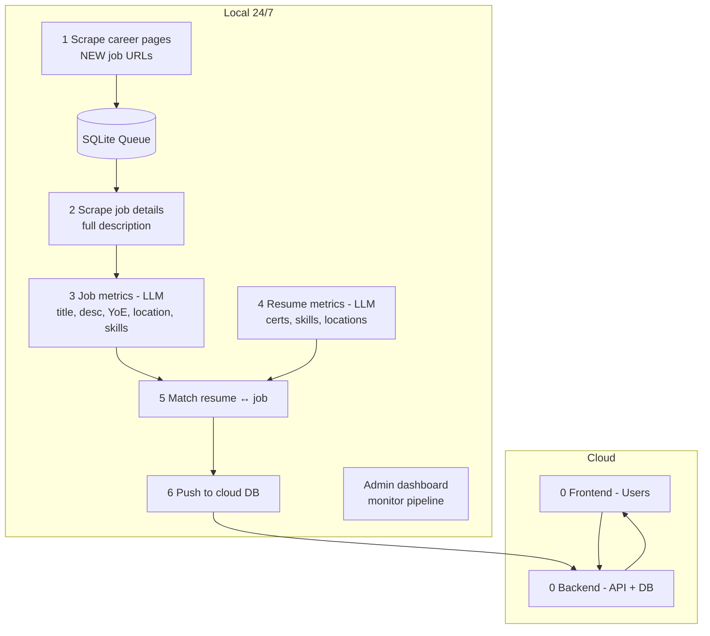

# Job Search Platform — Architecture & Reference

> **Purpose:** Single source of truth for the full system — vision, pipeline design, data schemas, implementation status, and how to run everything locally 24/7.

Last updated: 2026-06-28 (parallel workers + local Ollama models)

---

## Table of contents

1. [Long-term vision](#long-term-vision)
2. [System map](#system-map)
3. [Projects overview](#projects-overview)
4. [End-to-end data flow](#end-to-end-data-flow)
5. [Pipeline queue & job lifecycle](#pipeline-queue--job-lifecycle)
6. [Data schemas](#data-schemas)
7. [Production design decisions](#production-design-decisions)
8. [Folder layout](#folder-layout)
9. [Implementation status](#implementation-status)
10. [How to run locally (24/7)](#how-to-run-locally-247)
11. [Admin dashboard](#admin-dashboard)
12. [Cloud integration (future)](#cloud-integration-future)
13. [Roadmap](#roadmap)
14. [Open decisions](#open-decisions)

---

## Long-term vision

Build a **real-time job matching platform**:

1. **Scrape** company career pages for **new** job postings (local, 24/7).
2. **Scrape** full job descriptions from each URL.
3. **Extract structured job metrics** (title, description, years of experience, location, skills) using a **local LLM**.
4. **Extract structured resume metrics** from user-uploaded resumes (experience, locations, certifications, skills).
5. **Match** each resume against new jobs.
6. **Push** matched jobs to the **cloud database**.
7. Users refresh the **cloud portal** and instantly see relevant new jobs.

```
Local machine (24/7)                         Cloud
─────────────────────                        ─────
Project 1 → 2 → 3 → 5 → 6  ───push───►  Backend API + DB
                ▲                              │
Project 4 (resumes) ─┘                         ▼
                                         Frontend (users)
```

**Split:**
- **Cloud:** `0_job_search_frontend_cloud` + `0_job_search_backend` (API + PostgreSQL)
- **Local:** Projects 1–6 + `pipeline/` orchestration + admin monitoring

---

## System map

```
┌─────────────────────────────────────────────────────────────────────────────┐
│  CLOUD                                                                       │
│  0_job_search_frontend_cloud   Angular portal (users)                        │
│  0_job_search_backend          API + PostgreSQL (planned)                    │
└─────────────────────────────────────────────────────────────────────────────┘
                                    ▲
                                    │ Project 6: push matched jobs
┌───────────────────────────────────┴─────────────────────────────────────────┐
│  LOCAL (24/7)                                                                │
│                                                                              │
│  pipeline/          SQLite queue + workers + admin dashboard                 │
│       │                                                                      │
│  ┌────┴────┬────────────┬────────────┬────────────┬────────────┐            │
│  │    1    │     2      │     3      │  4 / 5 / 6 │   admin    │            │
│  │ scrape  │  details   │ job metrics│ resume /   │ monitoring │            │
│  │  URLs   │  scrape    │  (LLM)     │ match/push │ dashboard  │            │
│  └─────────┴────────────┴────────────┴────────────┴────────────┘            │
└─────────────────────────────────────────────────────────────────────────────┘
```

### Mermaid — full pipeline



---

## Projects overview

| # | Folder | Role | Input | Output | Runs on |
|---|--------|------|-------|--------|---------|
| **0a** | `0_job_search_frontend_cloud` | User portal (jobs, resume, matching UI) | Cloud API | UI for users | Cloud |
| **0b** | `0_job_search_backend` | REST API + PostgreSQL | Push from project 6 | Data for frontend | Cloud *(planned)* |
| **1** | `1_scrape_job_careers_pages` | Discover **new** job URLs from company career pages | Company configs | `jobs_dashboard/final_job_list.json` | Local |
| **2** | `2_get_job_details_using_job_link` | Scrape **full** job page from URL | Job list / pipeline queue | `job_details/{jobId}-{company}-{time}.json` | Local |
| **3** | `3_create_job_metrics_using_llm` | Extract **job metrics** via local LLM | Detail JSON | `job_metrics/{jobId}-{company}-{time}-metrics.json` | Local |
| **4** | `4_create_resume_metrics_using_llm` | Extract **resume metrics** via LLM | User resume uploads | `resume_metrics/{userId}-{time}-metrics.json` | Local |
| **5** | `5_match_resume_with_job_metrics` | Score resume ↔ job | Job + resume metrics | `matches/{jobId}-{company}-{time}-matches.json` | Local |
| **6** | `6_push_jobs_to_cloud_db` | Push matches to cloud DB | Match results | Cloud API / DB | Local |
| — | `pipeline/` | Queue, workers, orchestration, admin | Cross-project | `pipeline_data/pipeline.db` | Local |

### Project 1 — what it does

- Scrapes configured company career pages (Playwright + CSS selectors).
- Compares scraped job IDs against `confidential/confidential_job_ids.json` (known jobs).
- Appends **only new jobs** to `jobs_dashboard/final_job_list.json`.
- **Automatically enqueues** new jobs into the central pipeline queue for project 2+.

### Project 2 — what it does

- Reads jobs from the pipeline queue (or `final_job_list.json` for backfill).
- Visits each `jobUrl` and extracts full description.
- Saves one JSON file per job; tracks progress in `scraped_registry.json`.
- Extraction order: **API** (SmartRecruiters, Greenhouse) → **JSON-LD** → **company config** → **generic DOM**.

### Project 3 — what it does

- Reads detail JSON from project 2.
- Sends description to **local Ollama LLM** (with regex fallback).
- Produces structured metrics: title, description, years of experience, location, **skills list**.

### Project 4 — what it does *(planned)*

- Receives resume files from cloud backend (upload webhook or poll).
- LLM extracts: years of experience, preferred locations, certifications, skills.

### Project 5 — what it does

- Compares job metrics vs all resume metrics.
- Currently: skill-overlap scoring (upgradeable to semantic LLM matching).
- Outputs ranked match list per job.

### Project 6 — what it does *(stub)*

- POSTs job + metrics + matches to cloud backend API.
- Users see new matched jobs when they refresh the portal.

---

## End-to-end data flow

```
Career page
    │
    ▼
[1] final_job_list.json          ← lightweight: company, jobId, title, URL, location
    │
    ▼  (auto-enqueue)
[pipeline] pipeline.db           ← queue: stage, status, artifact paths
    │
    ▼
[2] job_details/*.json           ← full scraped description + metadata
    │
    ▼
[3] job_metrics/*-metrics.json   ← structured: title, desc, YoE, location, skills
    │
    ▼
[5] matches/*-matches.json       ← resume ↔ job scores
    │         ▲
    │         │
[4] resume_metrics/*.json ───────┘
    │
    ▼
[6] Cloud DB ──► [0] Frontend
```

### Handover between projects

| From | To | Mechanism |
|------|-----|-----------|
| Project 1 → Pipeline | `JobRegistry._enqueue_pipeline_jobs()` | Inserts row in `pipeline_jobs` with stage `details`, status `pending` |
| Pipeline → Project 2 | `DetailsWorker` claims from queue | Saves detail file, advances to `metrics` |
| Pipeline → Project 3 | `MetricsWorker` claims from queue | Saves metrics file, advances to `match` |
| Pipeline → Project 5 | `MatchWorker` | Saves match file, advances to `push` |
| Pipeline → Project 6 | `PushWorker` | Calls cloud API, advances to `completed` |

---

## Pipeline queue & job lifecycle

Every job is tracked in **`pipeline_data/pipeline.db`** with key:

```
{company_slug}:{job_id}
```

Example: `cognizant:00068588681`

### Stage flow

```
discovered ──► details ──► metrics ──► match ──► push ──► completed
```

### Status per stage

| Status | Meaning |
|--------|---------|
| `pending` | Waiting for a worker |
| `processing` | Worker claimed this job |
| `done` | Stage finished successfully |
| `failed` | Error occurred (retry up to 3 times) |

### Stage reference

| Stage | Worker | Input | Output artifact |
|-------|--------|-------|-----------------|
| `discovered` | Project 1 (enqueue only) | Career scrape | Queue row created |
| `details` | `details-worker` | `jobUrl` | `2_.../job_details/*.json` |
| `metrics` | `metrics-worker` | Detail JSON | `3_.../job_metrics/*-metrics.json` |
| `match` | `match-worker` | Job metrics + resume metrics | `5_.../matches/*-matches.json` |
| `push` | `push-worker` | Match results | Cloud API call |
| `completed` | — | — | Job fully processed |

### Resume track (parallel)

```
resume_uploaded ──► resume_metrics ──► feeds match stage
```

Stored in `resume_pipeline` table (same SQLite DB).

### SQLite tables

| Table | Purpose |
|-------|---------|
| `pipeline_jobs` | Job queue state, artifact file paths, errors, retries |
| `pipeline_events` | Audit log (every stage transition) |
| `resume_pipeline` | Resume processing state |
| `job_resume_matches` | Match results index |

---

## Data schemas

### Project 1 — job list entry (`final_job_list.json`)

```json
{
  "company": "Cognizant",
  "jobId": "00068588681",
  "jobTitle": "IBM Maximo Developer",
  "jobUrl": "https://careers.cognizant.com/india-en/jobs/00068588681/ibm-maximo-developer/",
  "location": "Hyderabad, Telangana, India",
  "pageNumber": 1,
  "scrapedAt": "2026-06-19T10:16:02.628835+00:00"
}
```

### Project 2 — job detail file

```json
{
  "sourceJob": { "...": "from project 1" },
  "sourceUrl": "https://...",
  "scrapedAt": "2026-06-28T14:28:54+05:30",
  "extractionMethod": "json_ld",
  "details": {
    "title": "IBM Maximo Developer",
    "description": "Full plain-text description...",
    "descriptionHtml": "<p>...</p>",
    "location": "Hyderabad, Telangana, India",
    "employmentType": "FULL_TIME",
    "postedDate": "2026-06-19",
    "companyName": "Cognizant"
  }
}
```

Filename: `{jobId}-{company}-{YYYYMMDD-HHMMSS}.json`

### Project 3 — job metrics file

```json
{
  "jobId": "00068588681",
  "company": "Cognizant",
  "sourceDetailFile": "00068588681-cognizant-20260628-142854.json",
  "extractedAt": "2026-06-28T15:05:20+05:30",
  "extractionMethod": "llm",
  "promptVersion": "1.0",
  "llm": { "provider": "ollama", "model": "llama3.1" },
  "metrics": {
    "jobTitle": "IBM Maximo Developer",
    "description": "Cleaned full description text",
    "yearsOfExperience": {
      "min": 10,
      "max": 14,
      "raw": "minimum of 10 years"
    },
    "location": "Hyderabad, Telangana, India",
    "skills": ["IBM Maximo", "SQL", "Java", "Maximo Automation Script"]
  }
}
```

Filename: `{jobId}-{company}-{timestamp}-metrics.json`

**Required metrics fields:**

| Field | Type | Description |
|-------|------|-------------|
| `jobTitle` | string | Job title |
| `description` | string | Full or cleaned description |
| `yearsOfExperience.min` | number \| null | Minimum years |
| `yearsOfExperience.max` | number \| null | Maximum years |
| `yearsOfExperience.raw` | string | As written in posting |
| `location` | string | Job location |
| `skills` | string[] | **All** technical skills, tools, frameworks, platforms |

### Project 4 — resume metrics file *(planned)*

```json
{
  "resumeId": "user-123",
  "userId": "user-123",
  "sourceResumeFile": "resume_inbox/user-123.pdf",
  "extractedAt": "2026-06-28T16:00:00+05:30",
  "metrics": {
    "yearsOfExperience": { "min": 8, "max": 8, "raw": "8 years" },
    "preferredLocations": ["Bangalore", "Hyderabad"],
    "certifications": ["AWS Solutions Architect", "Oracle SQL Certification"],
    "skills": ["Python", "AWS", "Kubernetes", "Docker"]
  }
}
```

### Project 5 — match file

```json
{
  "jobKey": "cognizant:00068588681",
  "jobId": "00068588681",
  "company": "Cognizant",
  "sourceMetricsFile": "00068588681-cognizant-20260628-150520-metrics.json",
  "matchedAt": "2026-06-28T16:30:00+05:30",
  "topMatchScore": 72.5,
  "matches": [
    {
      "resumeKey": "user-123",
      "userId": "user-123",
      "matchScore": 72.5,
      "matchedSkills": ["Java", "SQL", "Oracle"]
    }
  ]
}
```

---

## Production design decisions

| Concern | Solution | Why |
|---------|----------|-----|
| **Durability** | SQLite WAL mode (`pipeline_data/pipeline.db`) | Survives crashes; no extra services on one machine |
| **No double-processing** | `BEGIN IMMEDIATE` + atomic claim | Two workers cannot grab the same job |
| **Crash recovery** | `failed` status + retry count (max 3) | Admin can reset failed jobs to pending |
| **24/7 operation** | Worker threads poll every 5s | Simple, reliable on local Windows machine |
| **New job handover** | Project 1 auto-enqueues on `register_new_jobs()` | No manual step when scraper finds jobs |
| **Monitoring** | FastAPI admin at port 8090 | See stage counts, errors, recent events |
| **LLM offline fallback** | Regex skill + experience extraction | Pipeline continues if Ollama is down |
| **Cloud push graceful degradation** | Push worker logs warning if API unreachable | Local pipeline does not block on missing backend |
| **Scale later** | Same queue schema → PostgreSQL + Redis | Upgrade path when moving off single machine |

### Parallel processing (multiple jobs at once)

Stages run **in parallel** — several jobs are processed at the same time within each stage:

| Stage | Default threads | What runs in parallel |
|-------|-----------------|------------------------|
| **details** | 3 | 3 Playwright browsers scraping different job URLs |
| **metrics** | 2 | 2 Ollama LLM calls extracting job metrics |
| **match** | 2 | 2 match jobs against resumes |
| **push** | 1 | 1 cloud API push at a time |

All stages also run **at the same time** (details + metrics + match + push concurrently). A job flows through stages sequentially, but many jobs are in flight across the pipeline.

Configure in `pipeline/config.json` → `worker_concurrency`:

```json
"worker_concurrency": {
  "details": 3,
  "metrics": 2,
  "match": 2,
  "push": 1
}
```

CLI override (same count for all selected workers):

```bash
python pipeline/run_workers.py --concurrency 4
```

**Notes:**
- Each details thread has its **own browser** (no shared Playwright).
- SQLite `BEGIN IMMEDIATE` ensures two threads never claim the same job.
- Ollama queues requests internally — 2 metrics threads is a good default for `llama3.1:8b`.
- Lower `details` concurrency if RAM is tight (each browser ~200–400 MB).

### Local Ollama models

Models available on this machine (configure in `pipeline/config.json`):

| Model | Size | Pipeline use |
|-------|------|----------------|
| `llama3.1:8b` | 4.9 GB | **Job metrics** (project 3), **resume metrics** (project 4) — default |
| `deepseek-r1:14b` | 9.0 GB | Optional: complex reasoning / hard extractions |
| `qwen2.5-coder:1.5b-base` | 986 MB | Optional: code-heavy job postings |
| `gemma3:1b` | 815 MB | Optional: fast lightweight tasks |
| `nomic-embed-text:latest` | 274 MB | **Future:** semantic matching embeddings (project 5) |

```json
"ollama_model": "llama3.1:8b",
"ollama_models": {
  "job_metrics": "llama3.1:8b",
  "resume_metrics": "llama3.1:8b",
  "embeddings": "nomic-embed-text:latest",
  "code": "qwen2.5-coder:1.5b-base",
  "reasoning": "deepseek-r1:14b"
}
```

Verify installed models: `ollama list`

### Extraction strategy (Project 2)

| Priority | Method | Used for |
|----------|--------|----------|
| 1 | SmartRecruiters API | Nagarro |
| 2 | Greenhouse API | Capgemini |
| 3 | JSON-LD `JobPosting` | Cognizant, Citi, Mastercard, BNY, etc. |
| 4 | Company config selectors | Infosys, Wipro, IBM, Accenture |
| 5 | Generic DOM fallback | Everything else |

---

## Folder layout

```
final_Project_FULL/
├── ARCHITECTURE.md                          ← this file
│
├── 0_job_search_frontend_cloud/             # Cloud — Angular user portal
├── 0_job_search_backend/                    # Cloud — API + DB (planned)
│
├── 1_scrape_job_careers_pages/              # Local — discover job URLs
│   ├── companies/                           # Per-company scrape configs
│   ├── jobs_dashboard/
│   │   └── final_job_list.json              # Master list of all new jobs
│   ├── confidential/
│   │   └── confidential_job_ids.json        # Known job IDs (dedup)
│   ├── scheduler.py                         # 24/7 staggered scraper
│   └── job_registry.py                      # Enqueues new jobs → pipeline
│
├── 2_get_job_details_using_job_link/      # Local — scrape full job pages
│   ├── job_details/                         # Output JSON per job
│   ├── company_configs/                     # Per-company detail selectors
│   ├── scraped_registry.json
│   └── job_details_index.json
│
├── 3_create_job_metrics_using_llm/          # Local — job metrics via LLM
│   ├── job_metrics/                         # Output metrics JSON
│   ├── llm/ollama_client.py
│   └── prompts/job_metrics_v1.txt
│
├── 4_create_resume_metrics_using_llm/       # Local — resume metrics (stub)
│   └── resume_metrics/
│
├── 5_match_resume_with_job_metrics/         # Local — matching
│   └── matches/
│
├── 6_push_jobs_to_cloud_db/                 # Local — cloud push (stub)
│
├── pipeline/                                # Local — orchestration
│   ├── core/
│   │   ├── config.py                        # Paths + settings
│   │   ├── database.py                      # SQLite schema
│   │   ├── queue.py                         # Enqueue, claim, complete, fail
│   │   └── models.py                        # Stage / status enums
│   ├── workers/
│   │   ├── details_worker.py                # → project 2
│   │   ├── metrics_worker.py                # → project 3
│   │   ├── match_worker.py                  # → project 5
│   │   └── push_worker.py                   # → project 6
│   ├── admin/
│   │   └── app.py                           # Monitoring dashboard
│   ├── config.json                          # Ollama URL, cloud API, poll interval
│   ├── run_workers.py
│   ├── run_workers.bat
│   └── run_all_local.bat
│
└── pipeline_data/
    └── pipeline.db                          # gitignored — queue + events
```

---

## Implementation status

| Component | Location | Status |
|-----------|----------|--------|
| Architecture doc | `ARCHITECTURE.md` | ✅ Done |
| SQLite queue + state machine | `pipeline/core/` | ✅ Done |
| Details worker (project 2) | `pipeline/workers/details_worker.py` | ✅ Done |
| Metrics worker (project 3) | `pipeline/workers/metrics_worker.py` | ✅ Done |
| Match worker (project 5) | `pipeline/workers/match_worker.py` | ✅ Basic skill overlap |
| Push worker (project 6) | `pipeline/workers/push_worker.py` | ⚠️ Stub (needs cloud backend) |
| Project 1 → queue handover | `1_.../job_registry.py` | ✅ Done |
| Project 3 standalone CLI | `3_.../main.py` | ✅ Done |
| Ollama LLM client | `3_.../llm/ollama_client.py` | ✅ Done |
| Project 4 resume metrics | `4_.../` | ❌ Stub |
| Cloud backend | `0_job_search_backend/` | ❌ Not started |
| Frontend real API | `0_job_search_frontend_cloud/` | ❌ Mock data only |
| Admin dashboard | `pipeline/admin/app.py` | ✅ Done |

---

## How to run locally (24/7)

### One-time setup

```bash
# From repo root: final_Project_FULL/

pip install -r pipeline/requirements.txt
pip install -r 2_get_job_details_using_job_link/requirements.txt
pip install -r 3_create_job_metrics_using_llm/requirements.txt
playwright install chromium

# Local LLM (project 3)
ollama pull llama3.1:8b
```

### Backfill existing jobs into queue

```bash
python pipeline/run_workers.py --backfill-only
```

### Three terminals (recommended)

```bash
# Terminal 1 — scrape career pages for new jobs
cd 1_scrape_job_careers_pages
python scheduler.py

# Terminal 2 — pipeline workers (details → metrics → match → push)
cd ..
python pipeline/run_workers.py

# Terminal 3 — admin monitoring dashboard
python pipeline/admin/app.py
```

### Or one click (Windows)

```
START_JOB_PIPELINE.bat     ← Project 1 scraper + Project 2 details + admin dashboard
START_FULL_PIPELINE.bat    ← Above + Project 3 LLM metrics (Ollama)
pipeline\run_all_local.bat ← Workers + admin only (no scraper)
```

### Useful CLI flags

```bash
# Only specific workers
python pipeline/run_workers.py --workers details metrics

# Show browser window (debug project 2)
python pipeline/run_workers.py --visible

# Override parallelism for all workers
python pipeline/run_workers.py --concurrency 4

# Retry all failed jobs
python pipeline/run_workers.py --retry-failed

# Standalone job metrics (no pipeline)
cd 3_create_job_metrics_using_llm
python main.py --detail-file ../2_.../job_details/some-file.json
python main.py --all --no-llm    # regex fallback without Ollama
```

### Configuration (`pipeline/config.json`)

```json
{
  "worker_poll_seconds": 3,
  "max_retries": 3,
  "worker_concurrency": {
    "details": 3,
    "metrics": 2,
    "match": 2,
    "push": 1
  },
  "ollama_base_url": "http://localhost:11434",
  "ollama_model": "llama3.1:8b",
  "ollama_models": {
    "job_metrics": "llama3.1:8b",
    "resume_metrics": "llama3.1:8b",
    "embeddings": "nomic-embed-text:latest",
    "code": "qwen2.5-coder:1.5b-base",
    "reasoning": "deepseek-r1:14b"
  },
  "cloud_api_base_url": "http://localhost:8000"
}
```

---

## Admin dashboard

**URL:** `http://localhost:8090`

| Feature | Description |
|---------|-------------|
| Jobs by stage | Count per stage + status |
| Recent jobs | Company, ID, title, stage, error |
| Recent events | Audit log of pipeline transitions |
| Retry failed | Reset failed jobs to pending |
| Backfill | Import all jobs from `final_job_list.json` |

**API endpoints:**

| Method | Path | Description |
|--------|------|-------------|
| GET | `/api/stats` | Pipeline statistics JSON |
| GET | `/api/jobs?stage=details&status=pending` | Filtered job list |
| POST | `/api/retry-failed` | Reset failed jobs |
| POST | `/api/backfill` | Enqueue jobs from dashboard list |

---

## Cloud integration (future)

### Project 6 → Backend API

```
POST {cloud_api_base_url}/api/pipeline/jobs
Content-Type: application/json

{
  "jobKey": "cognizant:00068588681",
  "job": { ... job metrics payload ... },
  "matches": [
    { "userId": "user-123", "matchScore": 72.5, "matchedSkills": ["Java", "SQL"] }
  ]
}
```

### Resume upload → Project 4 (planned)

```
Cloud backend receives resume upload
    → stores file
    → notifies local worker (webhook or poll)
    → project 4 extracts resume metrics
    → resume_pipeline table updated
    → match worker picks up on next job
```

### User experience

1. Local pipeline processes new job end-to-end.
2. Project 6 pushes to cloud DB.
3. User opens portal → sees new matched jobs on refresh.

---

## Roadmap

| Phase | Scope | Status |
|-------|-------|--------|
| **A** | Pipeline core, SQLite queue, workers framework | ✅ Done |
| **B** | Wire project 1 → queue; project 2 details worker | ✅ Done |
| **C** | Project 3 job metrics + Ollama | ✅ Done |
| **D** | Admin monitoring dashboard | ✅ Done |
| **E** | Projects 4–6 stubs + queue hooks | ⚠️ Partial |
| **F** | Project 4 — resume metrics + upload handover | 🔜 Next |
| **G** | `0_job_search_backend` + project 6 live push | 🔜 Next |
| **H** | Semantic LLM matching in project 5 | 🔜 Later |
| **I** | Frontend → real API (remove mocks) | 🔜 Later |
| **J** | PostgreSQL queue migration (if scaling beyond one machine) | 🔜 Later |

---

## Open decisions

Record decisions here as they are made:

| # | Question | Options | Decision |
|---|----------|---------|----------|
| 1 | Local LLM | Ollama / LM Studio / other | **Ollama `llama3.1:8b`** (installed locally) |
| 2 | Cloud DB | PostgreSQL / MongoDB / other | *TBD* |
| 3 | Resume handover | Webhook / poll API / shared folder | *TBD* |
| 4 | Backfill | Process all queued jobs / new only | *TBD* |
| 5 | Description in metrics | Full text / LLM summary | **Full text** (current) |
| 6 | Match algorithm | Skill overlap / semantic LLM | **Skill overlap** (v1); `nomic-embed-text` later |
| 7 | Parallelism | Serial / parallel per stage | **Parallel** — see `worker_concurrency` in config |

---

## Quick reference — one-liner per project

| Project | One line |
|---------|----------|
| **1** | "Here are all the **new job links**." |
| **2** | "Here is the **full job description** for each link." |
| **3** | "Here are the **structured metrics** for each job." |
| **4** | "Here are the **structured metrics** for each resume." |
| **5** | "Here is **how well each resume matches** each job." |
| **6** | "Here are the **matched jobs in the cloud DB** for users." |

---

*Keep this file updated when adding projects, changing schemas, or completing roadmap phases.*
